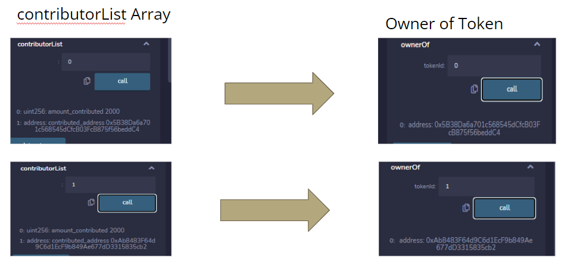

# Crypto Crowdfunding 

## Description
This project aims to start a crowdfunding contract in solidity and distribute NFTs as an incentive for contributors in a form of a picture (using a streamlit front end). 

## Table of Contents
- [Crypto Crowdfunding](#crypto-crowdfunding)
  - [Description](#description)
  - [Table of Contents](#table-of-contents)
  - [Goals](#goals)
  - [Technologies](#technologies)
  - [Instructions](#instructions)
  - [Application](#application)
    - [Deploying a new contract](#deploying-a-new-contract)
    - [Making a contribution to the contract](#making-a-contribution-to-the-contract)
    - [NFT](#nft)
  - [Centralized vs Decentralized Contracts](#centralized-vs-decentralized-contracts)
  - [Conclusion](#conclusion)
  - [Contributors](#contributors)
  - [References and Resources](#references-and-resources)
  - [License](#license)

## Goals
To create a decentralized fundraising in Solidity

## Technologies
* Ganache
* Remix
* Javascript 
* Moralis Mutant NFT Engine
* Python
* Solidity
* Web3
* Pathlib
* Os
* Pandas
* Streamlit

## Instructions
1. Clone this [repository](https://github.com/GuilleMGN/Project3-Group3)
2. Load up [Ganache](https://trufflesuite.com/ganache/)
3. In the [deployer.py](smart_contract_code/deployer.py) file, change the `address` and `private_key` variables so that they are one of the accounts from Ganache (representing a MetaMask account)
4. `streamlit run deployer.py`
5. Enter the details of your fundraising initiative in the streamlit web-form. The details are saved to the `.csv`
6. `streamlit run contribution.py`
7. Choose the previously created contract from step 5
8. Make a contribution to the selected contract
9. When the fundraising is complete, the application mints an NFT for each contributor in the contributor list array

## Application
### Deploying a new contract

 

### Making a contribution to the contract

### NFT
Leveraging and editing the code from [moralis-mutant-nft-engine](https://github.com/ashbeech/moralis-mutants-nft-engine), we have created randomized images to show appreciation to the contributors. 

We have randomly layered background, shapes and notes for unique images which would have been used for generating NFTs. 

Below are steps taken to successfully generate images and sent to Moralis, which provides managed backend services for blockchain projects. 

1. Simple images were generated and constructed to be layered  

2. Updated configure.js file in input folder to reflect the new layers

3. Run index.js file to generate randomly layered images for NFT and to send the images to Moralis (3) 

Below are the hyperlinks to a randomly generated image and metadata.

[Moralis NFT Dashboard URL](https://ggdm8rselphi.usemoralis.com:2083/apps/moralisDashboard/browser/Metadata) 
[Moralis NFT Image URL](https://ipfs.moralis.io:2053/ipfs/QmQfnGGbQxZtTNQ8mKvKLvNQJaX1J2xc2n9iDKhjXD5zFF/images/0000000000000000000000000000000000000000000000000000000000000009.png)  
[Moralis NFT Metadata json file URL](https://ipfs.moralis.io:2053/ipfs/QmcaUdQt3Ts2wAiEXBoQmccLsyu7jBqzbdMbVWRoV52a6p/metadata/0000000000000000000000000000000000000000000000000000000000000009.json)

## Centralized vs Decentralized Contracts
Smart Contracts are scripts on the blockchain that can be interacted with by the public.

There are two methods to interact with these scripts that we learned in class: 

1)	Remix (Browser Based IDE) 
2)	Python Web3 Library 

Depending on the use, blockchain can have a centralized or decentralized implementation. 

In class we learned about the decentralized Ethereum blockchain.

Owing to its decentralized nature, anyone can interact with the contract, so the contract has to be designed so that it accommodates for this.

In our contract, we considered that the stakeholders of the contract would require an element of control after the contract had been deployed onto the blockchain, returning a measure of centralization to the process.

Specifically, the contract allows the deployer (end user) to choose whether or not the contract should have the option to issue refunds to its contributors.

## Conclusion

## Contributors

## References and Resources
[Moralis Mutant NFT Engine](https://github.com/ashbeech/moralis-mutants-nft-engine)

## License

Copyright © 2022
